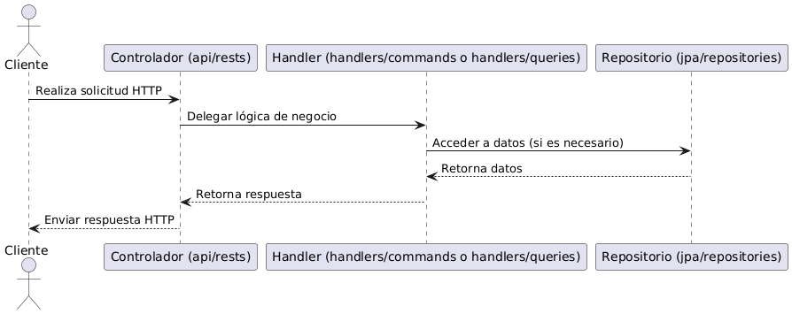

## Estructura de Componentes - Backend

En el presente documento se describe la estructura de componentes del backend del proyecto (desarrollado en Spring Boot). Se detallan las responsabilidades de cada paquete y cómo interactúan entre sí para abordar la lógica de negocio, el acceso a datos y la seguridad.

---

### Arquitectura General

El backend sigue un enfoque basado en el patrón **Command Query Responsibility Segregation (CQRS)**, donde se separan las operaciones de escritura (*commands*) y lectura (*queries*).

#### Capas:
- **Controladores (*api/rests*)**: Manejan las solicitudes HTTP y delegan la lógica de negocio a los *handlers*.
- **Handlers (*handlers/commands* y *handlers/queries*)**: Encapsulan la lógica de negocio separando las modificaciones del estado de la aplicación y las consultas de datos.
- **Capa de Persistencia (*jpa*)**: Contiene las entidades y repositorios para acceder a la base de datos.
- **Servicios (*services*)**: Contiene lógica auxiliar necesaria para el funcionamiento del backend.
- **Configuraciones (*config*)**: Definiciones y configuraciones generales del sistema. Ejemplo: Configuración CORS.

---

### Componentes Principales

#### API (*api*)
Contiene los controladores que exponen los endpoints:
- **Rests**: Define los controladores REST que reciben las peticiones del frontend y delegan la ejecución en los *handlers*.
- **Exceptions**: Manejo centralizado de excepciones.
- **Types**: Definición de tipos de datos usados en la API.

#### Handlers (*handlers*)
Encapsulan la lógica de negocio siguiendo el patrón **CQRS**:
- **Commands/impl**: Contiene comandos que modifican el estado del sistema.
- **Queries**: Maneja las consultas que recuperan información.
- **GlobalExceptionHandler**: Centraliza el manejo de errores.

#### Persistencia (*jpa*)
- **Entities**: Define las entidades que representan las tablas de la base de datos.
- **Repositories**: Contiene las interfaces de acceso a datos con Spring Data JPA.

#### Modelos (*models*)

#### Servicios (*services*)
Contiene lógica auxiliar que complementa los *handlers* y facilita operaciones del backend.

#### Seguridad (*SecurityConfig*)
Define la configuración de seguridad, utilizando **Spring Security**.

---

### Flujo de Datos

