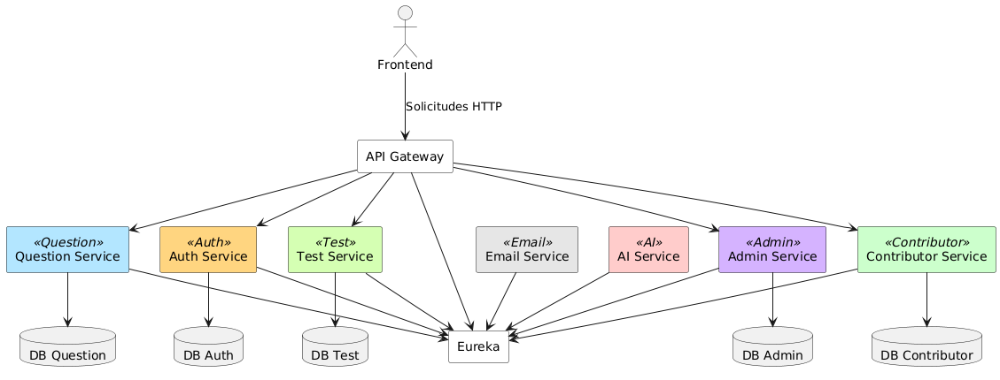
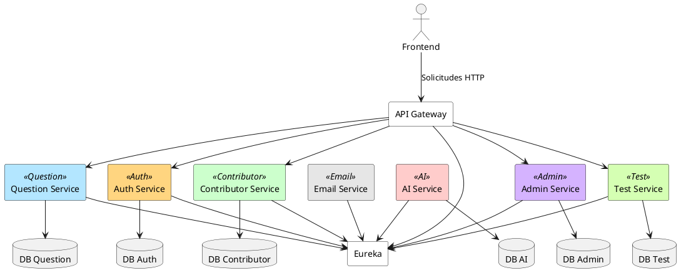

# Arquitectura de Microservicios - Plataforma Social de Aprendizaje

## Diagrama de microservicios

El siguiente diagrama representa los componentes principales de la plataforma, incluyendo el API Gateway, el servicio de descubrimiento (Eureka) y cada microservicio con su base de datos (cuando aplica).

 

## Definción de Microservicios:

### Auth Service:
Encargado de autenticación, generación de tokens y registro de colaboradores.

### Email Service:
Servicio de envío de correos.

### Question Service:
Gestión de preguntas, respuestas y su calificación. Además puede emitir eventos de reporte (manejados por Admin Service).

### Test Service:
Gestión de las pruebas de autoevaluación.

### AI Service:
Comunicación con la API de OpenAI para generar calificación automática de preguntas y generación de preguntas. 

### Contributor Service:
Gestión del perfil de los colaboradores, puntos XP, rachas, historial de pruebas, niveles (Aprendiz → Pensador → Sabio), etc.

### Admin Service:
Aquí se hace la moderación, revisión de reportes, eliminación de contenido (preguntas), sanciones a colaboradores (bannearlos), y configuración de normas de la comunidad.
