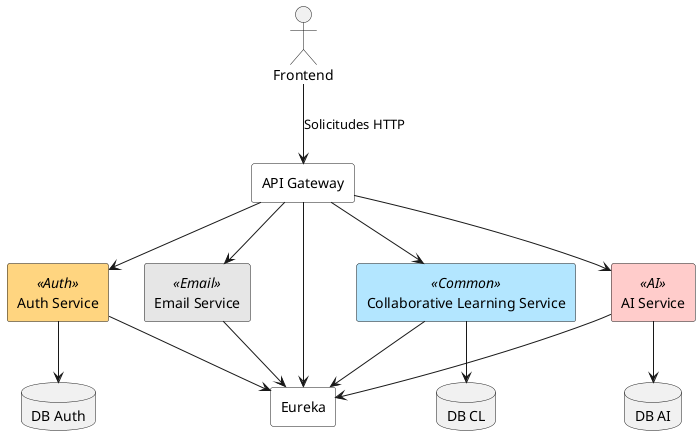

# Arquitectura de Microservicios - Plataforma Social de Aprendizaje

## Diagrama de Microservicios

El siguiente diagrama representa los componentes principales de la plataforma, incluyendo el API Gateway, el servicio de descubrimiento (Eureka) y los microservicios con sus respectivas bases de datos (cuando aplica).

## Definición de Microservicios
Auth Service:
Encargado de la autenticación de colaboradores y administradores, generación de tokens y registro de colaboradores.

## Email Service:
Servicio encargado de la gestión y envío de correos electrónicos a los colaboradores y administradores de la plataforma.

## AI Service:
Servicio encargado de la integración con la API de OpenAI para generar calificaciones automáticas de preguntas y también generar nuevas preguntas de manera inteligente.

## Collaborative Learning Service:
Este microservicio gestiona la creación, calificación y retroalimentación de preguntas, respuestas y pruebas. Permite a los colaboradores publicar preguntas, recibir respuestas, calificar contenido y generar pruebas estructuradas a partir de las preguntas registradas, con el objetivo de fomentar el aprendizaje colaborativo y el refuerzo de conceptos clave entre los estudiantes.
