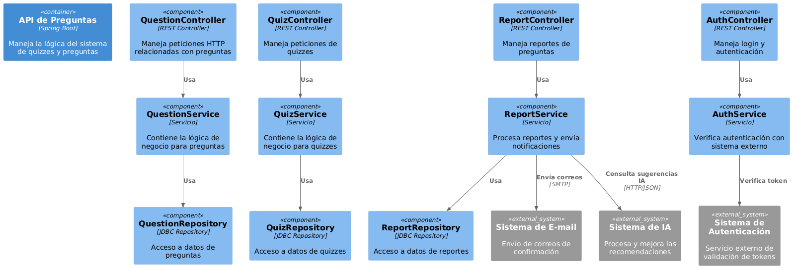

# Diagrama de Componentes - Sistema de Preguntas

## Descripción

Este diagrama representa la arquitectura interna del contenedor `API de Preguntas`, detallando sus principales componentes organizados por responsabilidad: controladores, servicios, repositorios y sus interacciones con sistemas externos. Sigue el modelo C4 (nivel de componentes), utilizando una arquitectura basada en servicios y separación de responsabilidades.

## Diagrama

## Notas

- Cada componente cumple con una **única responsabilidad**, promoviendo bajo acoplamiento y alta cohesión.
- Las dependencias entre capas (Controller → Service → Repository) están claramente representadas.
- El sistema interactúa con servicios externos de autenticación, correo electrónico e inteligencia artificial.
- Basado en tecnologías como **Spring Boot**, **JDBC** y protocolos estándar (`HTTP`, `SMTP`, `JSON`).

## Fecha de realización

25 de junio de 2025
