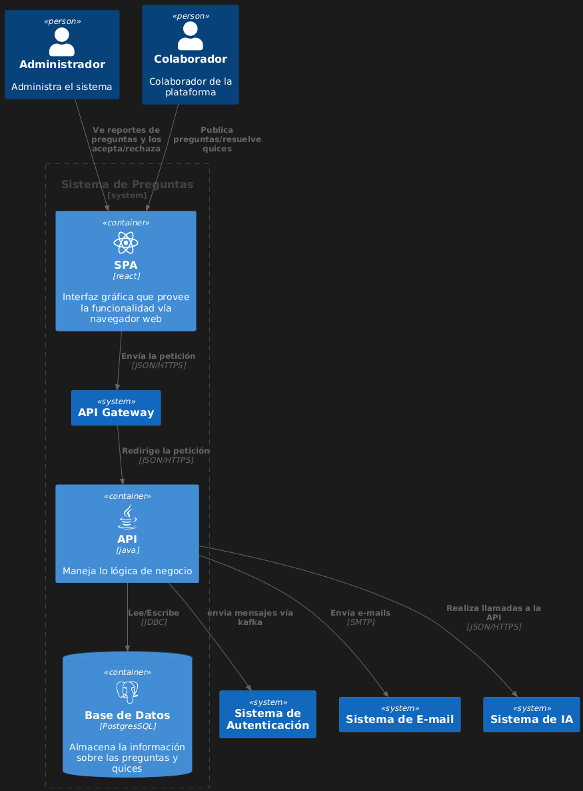

# Diagrama de Contenedores - Plataforma de Preguntas y Quices

## Descripción

Este diagrama muestra la estructura de contenedores del sistema, detallando los componentes principales, tecnologías utilizadas y sus interacciones. Sigue el modelo C4 (nivel de contenedores) y presenta una arquitectura modular con separación clara de responsabilidades.

## Diagrama

## Componentes Principales

### Actores:
- **Administrador**:
  - Administra el sistema
  - Revisa y gestiona reportes de preguntas
  - Publica preguntas y resuelve quices
  - Volumen: Moderación de contenido

### Contenedores:
1. **SPA (Single Page Application)**:
   - Tecnología: [React]
   - Función: Interfaz gráfica en navegador web
   - Comunicación: Envía peticiones via JSON/HTTPS

2. **API Gateway**:
   - Función: Redirección de peticiones
   - Protocolo: JSON/HTTPS

3. **API Backend**:
   - Tecnología: [Java]
   - Función: Maneja la lógica de negocio principal

4. **Base de Datos**:
   - Tecnología: [PostgreSQL]
   - Función: Almacena información de preguntas y quices

### Sistemas Externos:
- **Sistema de Autenticación**
- **Sistema de E-mail** (Comunicación via SMTP)
- **Sistema de IA** (Llamadas via JSON/HTTPS)
- **Solución del Programa**:
  - Envía mensajes via Kafka
  - Gestiona envío de e-mails

## Flujos Clave
1. El Administrador interactúa con la SPA
2. La SPA envía peticiones al API Gateway
3. El API Gateway redirige a la API Backend
4. La API Backend:
   - Persiste datos en PostgreSQL
   - Se comunica con sistemas externos (Autenticación, E-mail, IA)
5. La Solución del Programa gestiona mensajería y notificaciones

## Notas Técnicas
- Arquitectura basada en microservicios
- Comunicación asíncrona via Kafka para mensajería
- Autenticación delegada a sistema especializado
- Frontend moderno con React
- Backend robusto en Java
- Base de datos relacional PostgreSQL

## Fecha de Realización
25 de junio de 2025