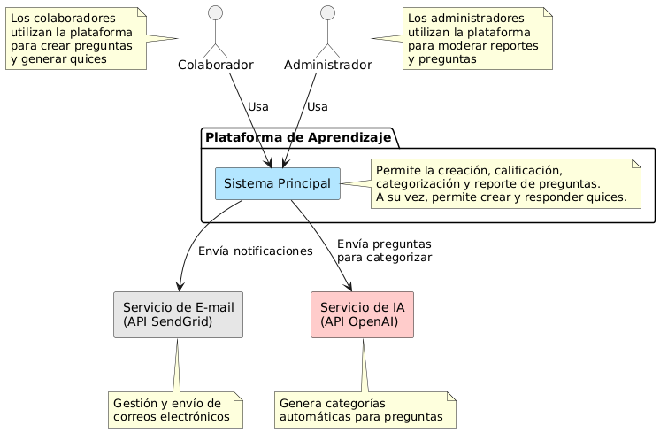

# Diagrama de Contexto - Plataforma de Aprendizaje

## Descripción

Este diagrama muestra el sistema principal y sus interacciones con los actores clave y sistemas externos. Representa el contexto general de la plataforma de aprendizaje, identificando los usuarios principales, sistemas colaboradores y flujos de comunicación.

## Diagrama

## Componentes Principales

### Actores:
- **Colaborador**: Utiliza la plataforma para crear preguntas y generar quizzes.
- **Administrador**: Modera reportes y preguntas en la plataforma.

### Sistema Central:
- **Plataforma de Aprendizaje**: 
  - Permite creación, calificación, categorización y reporte de preguntas.
  - Facilita la creación y respuesta de quizzes.

### Sistemas Externos:
- **Servicio de E-mail (API SendGrid)**:
  - Gestiona y envía notificaciones por correo electrónico.
- **Servicio de IA (API OpenAI)**:
  - Genera categorías automáticas para preguntas.

## Interacciones Clave
1. La plataforma envía notificaciones a usuarios mediante el Servicio de E-mail.
2. La plataforma solicita categorización automática de preguntas al Servicio de IA.
3. Los colaboradores interactúan con las funciones de creación de contenido.
4. Los administradores gestionan la moderación del contenido.

## Notas Técnicas
- Arquitectura basada en APIs para integración con servicios externos.
- Comunicación mediante protocolos estándar (HTTP, SMTP).
- Diseñado para escalabilidad y modularidad.

## Fecha de Realización
25 de junio de 2025