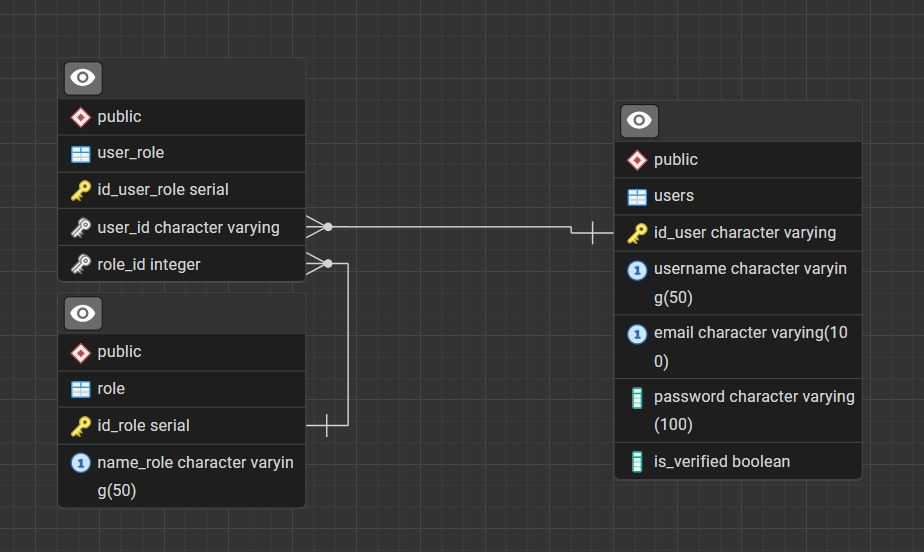

# Diagramas de Base de Datos - Collaborative Learning Service

## 1. Introducción

Este documento presenta los diagramas de la base de datos **Collaborative Learning Service**, que soporta una plataforma de aprendizaje colaborativo. La base de datos está diseñada para gestionar colaboradors, cuestionarios, preguntas, categorías, respuestas y reportes.

## 2. Diagrama de Relaciones de Entidad (ERD)

### 2.1. Diagrama ERD General

**Figura 1:** Diagrama de Relaciones de Entidad (ERD) que muestra las tablas y sus relaciones.

## 3. Descripción de las Tablas
---

### 3.1. `users`

**Descripción:** Almacena la información de los colaboradors de la plataforma.

| Columna           | Tipo                     | Descripción                                      |
|-------------------|--------------------------|--------------------------------------------------|
| id                | character varying(36)    | ID único del colaborador (UUID).                     |
| username          | character varying(50)    | Nombre de colaborador.                               |
| email             | character varying(100)   | Correo electrónico del colaborador (único).          |
| password          | character varying(100)   | Contraseña hasheada.                             |
| role              | character varying(20)    | Rol del colaborador (`admin`, `colaborador`). |
| profile_image     | text                     | URL de la imagen de perfil.                      |
| description       | character varying(255)   | Biografía o descripción del colaborador.             |
| created_at        | timestamp with time zone | Fecha y hora de creación del colaborador.            |
| xp_amount         | integer                  | Cantidad de puntos de experiencia.               |
| last_activity_date| date                     | Fecha de la última actividad del colaborador.        |
| daily_streak      | integer                  | Racha de días consecutivos de actividad.         |
| current_rank      | character varying(20)    | Rango actual del colaborador.                        |
| contacts          | character varying(255)   | Información de contacto.                         |
| labels            | character varying(255)   | Etiquetas asociadas al colaborador.                  |

---

### 3.2. `quiz`

**Descripción:** Almacena la información de los cuestionarios o quizzes.

| Columna     | Tipo                             | Descripción                                      |
|-------------|----------------------------------|--------------------------------------------------|
| id          | character varying(36)            | ID único del quiz (UUID).                        |
| id_quiz     | uuid                             | ID del quiz.                                     |
| grade       | integer                          | Calificación o nivel del quiz.                   |
| start_time  | timestamp with time zone         | Hora de inicio del quiz.                         |
| status      | character varying(25)            | Estado del quiz (`draft`, `published`, etc.).    |
| end_time    | timestamp without time zone      | Hora de finalización del quiz.                   |
| created_by  | character varying(36)            | ID del colaborador que creó el quiz (FK a users.id). |

---

### 3.3. `question`

**Descripción:** Almacena las preguntas de los cuestionarios.

| Columna         | Tipo                        | Descripción                                      |
|------------------|-----------------------------|--------------------------------------------------|
| id               | uuid                        | ID único de la pregunta.                         |
| text             | text                        | El texto de la pregunta.                         |
| image            | text                        | URL de la imagen asociada.                       |
| explanation      | character varying(1000)     | Explicación de la respuesta correcta.            |
| likes_count      | integer                     | Número de "me gusta".                            |
| dislikes_count   | integer                     | Número de "no me gusta".                         |
| created_at       | timestamp with time zone    | Fecha y hora de creación.                        |
| created_by       | character varying(36)       | ID del colaborador que creó la pregunta.             |
| is_visible       | boolean                     | Indica si la pregunta es visible.                |

---

### 3.4. `answer_options`

**Descripción:** Almacena las opciones de respuesta para cada pregunta.

| Columna     | Tipo       | Descripción                                                  |
|--------------|------------|--------------------------------------------------------------|
| id           | serial     | ID único de la opción de respuesta.                         |
| question_id  | uuid       | ID de la pregunta (FK a question.id).                       |
| text         | text       | Texto de la opción.                                         |
| is_correct   | boolean    | Indica si esta es la opción correcta.                       |

---

### 3.5. `category`

**Descripción:** Almacena las categorías para clasificar preguntas.

| Columna | Tipo                  | Descripción              |
|---------|-----------------------|--------------------------|
| id      | serial                | ID único de la categoría.|
| name    | character varying(100)| Nombre de la categoría.  |

---

### 3.6. `quiz_question`

**Descripción:** Tabla de unión para la relación de muchos a muchos entre quiz y question.

| Columna     | Tipo  | Descripción                                 |
|-------------|-------|---------------------------------------------|
| id          | uuid  | ID único de la relación.                    |
| id_quiz     | uuid  | ID del quiz (FK a quiz.id).                 |
| question_id | uuid  | ID de la pregunta (FK a question.id).       |

---

### 3.7. `question_category`

**Descripción:** Tabla de unión para la relación de muchos a muchos entre question y category.

| Columna      | Tipo     | Descripción                              |
|---------------|----------|------------------------------------------|
| question_id   | uuid     | ID de la pregunta (FK a question.id).    |
| category_id   | integer  | ID de la categoría (FK a category.id).   |

---

### 3.8. `question_report`

**Descripción:** Almacena los reportes de preguntas.

| Columna     | Tipo                        | Descripción                                          |
|--------------|-----------------------------|------------------------------------------------------|
| id           | uuid                        | ID del reporte.                                     |
| id_report    | uuid                        | ID del reporte.                                     |
| id_question  | uuid                        | ID de la pregunta reportada (FK a question.id).     |
| reason       | character varying(250)      | Razón del reporte.                                  |
| description  | text                        | Descripción detallada del reporte.                  |
| reported_at  | timestamp without time zone | Fecha y hora del reporte.                           |
| status       | character varying(30)       | Estado del reporte (`pending`, `resolved`, etc.).   |

---

### 3.9. `ranks`

**Descripción:** Almacena los rangos y los requisitos de XP para cada uno.

| Columna | Tipo                   | Descripción                                    |
|---------|------------------------|------------------------------------------------|
| rank    | character varying(20)  | Nombre del rango.                              |
| min_xp  | integer                | Mínimo de XP para alcanzar este rango.         |
| max_xp  | integer                | Máximo de XP para este rango.                  |

# Diagrama de Base de Datos - Auth Service

Este módulo maneja la autenticación y autorización de usuarios dentro de la plataforma Collaborative Learning Service. A continuación, se presenta el modelo de datos utilizado para gestionar usuarios, roles y la relación entre ellos.

## 2. Diagrama de Relaciones de Entidad (ERD)

**Figura 2:** Diagrama ERD del Auth Service mostrando la relación entre usuarios y roles.

## 3. Descripción de las Tablas

---

### 3.1. `users`

**Descripción:** Contiene la información básica del usuario para autenticación y control de acceso.

| Columna      | Tipo                     | Descripción                             |
|--------------|--------------------------|-----------------------------------------|
| id_user      | character varying        | ID único del usuario (UUID).            |
| username     | character varying(50)    | Nombre de usuario.                      |
| email        | character varying(100)   | Correo electrónico del usuario.         |
| password     | character varying(100)   | Contraseña hasheada.                    |
| is_verified  | boolean                  | Indica si el correo del usuario fue verificado. |

---

### 3.2. `role`

**Descripción:** Define los roles del sistema, como `admin`, `teacher`, `student`, entre otros.

| Columna     | Tipo                    | Descripción                      |
|-------------|-------------------------|----------------------------------|
| id_role     | serial                  | ID único del rol.               |
| name_role   | character varying(50)   | Nombre o tipo de rol.           |

---

### 3.3. `user_role`

**Descripción:** Tabla de unión que relaciona usuarios con uno o más roles.

| Columna       | Tipo                 | Descripción                                     |
|----------------|----------------------|-------------------------------------------------|
| id_user_role   | serial               | ID único de la relación.                        |
| user_id        | character varying    | ID del usuario (FK a `users.id_user`).          |
| role_id        | integer              | ID del rol (FK a `role.id_role`).               |

# Diagramas de Base de Datos - AI Service

Este diagrama presenta los diagramas de la base de datos para el "AI Service". Esta base de datos se encarga de la integración con la API de OpenAI, facilitando la calificación automática de preguntas y la generación inteligente de nuevas preguntas. La estructura se centra en la categorización y el almacenamiento de los "embeddings" para el procesamiento de lenguaje natural.

## 2.  Diagrama de Relaciones de Entidad (ERD)

**Figura 3:** Diagrama de Relaciones de Entidad (ERD) que muestra las tablas principales del AI Service.

# 3. Descripción de las Tablas

## 3.1. `category`
**Descripción:** Almacena las categorías utilizadas para clasificar preguntas y temas.

| Columna     | Tipo                    | Descripción                      |
|-------------|-------------------------|----------------------------------|
| id          | serial                  | ID único de la categoría. Es la clave primaria.              |
| name   | character varying(100)   | El nombre de la categoría (ej. 'Matemáticas', 'Historia', 'Ciencia').           |

## 3.2. `category_embedding`
**Descripción:** Almacena los vectores de "embedding" generados por un modelo de lenguaje (como el de OpenAI) para cada categoría. Estos vectores representan la categoría en un espacio vectorial, lo que permite realizar búsquedas de similitud o cálculos de proximidad para tareas de IA.

| Columna       | Tipo                 | Descripción                                     |
|----------------|----------------------|-------------------------------------------------|
| id   | serial               | ID único del embedding. Es la clave primaria.                       |
| category_id        | integer   | ID de la categoría a la que pertenece el embedding (FK a `category.id`).          |
| embedding        | double precision[]              | El vector de embedding almacenado como un arreglo de números de doble precisión. Este vector es crucial para el funcionamiento del servicio de IA.               |

# 4. Relaciones entre Tablas
## Relación category y category_embedding:
- Existe una relación de uno a muchos (1:N) entre category y category_embedding.
- Una categoría (category) puede tener múltiples embeddings asociados a ella a lo largo del tiempo, o un embedding para cada modelo o propósito.
- La clave foránea (category_id en category_embedding) asegura que cada embedding esté asociado a una categoría válida.