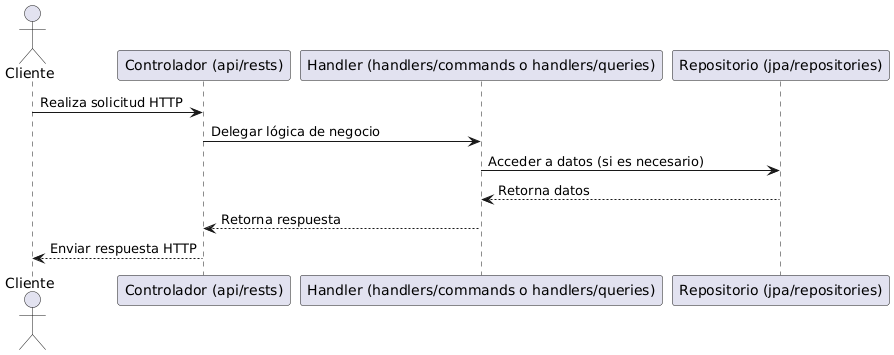

# Estructura de Componentes - Backend

En el presente documento se describe la estructura de componentes del backend del proyecto (desarrollado en **Spring Boot**). Se detallan las responsabilidades de cada paquete y cómo interactúan entre sí para abordar la lógica de negocio, el acceso a datos y la seguridad.

---

## Arquitectura General

El backend sigue un enfoque basado en el patrón arquitectónico **Command Query Responsibility Segregation (CQRS)**, donde se separan las operaciones de escritura (commands) y lectura (queries), con el objetivo de mejorar la claridad del código, la escalabilidad y la mantenibilidad.

### Patrón Arquitectónico: CQRS

- **Command:** Las operaciones que modifican el estado de la aplicación. No retornan datos (solo si la operación fue exitosa o no).
- **Query:** Operaciones que solo leen datos, sin modificar el estado de la aplicación. Devuelven la información solicitada.

---

## Capas

- **Controladores (`api/rests`)**: Manejan las solicitudes HTTP y delegan la lógica de negocio a los handlers.
- **Handlers (`handlers/commands` y `handlers/queries`)**: Encapsulan la lógica de negocio separando las modificaciones del estado de la aplicación y las consultas de datos.
- **Capa de Persistencia (`jpa`)**: Contiene las entidades y repositorios para acceder a la base de datos.
- **Servicios (`services`)**: Contiene lógica auxiliar necesaria para el funcionamiento del backend.
- **Configuraciones (`config`)**: Definiciones y configuraciones generales del sistema. Ejemplo: configuración CORS.
- **Seguridad (`SecurityConfig`)**: Define la configuración de seguridad, utilizando Spring Security.

---

## Estructura de Paquetes
```
api/
  ├── exceptions/
  ├── rests/
  ├── types/
config/
handlers/
  ├── commands/
  │   └── impl/
  ├── queries/
  │   └── impl/
jpa/
  ├── entities/
  ├── repositories/
models/
services/
SecurityConfig.java
```

---

## Componentes Principales

### 1. `api/`

- **exceptions/**: Contiene clases y definiciones de excepciones personalizadas que manejan errores específicos de la API.
- **rests/**: Incluye los controladores o endpoints REST que exponen la funcionalidad de la API, manejando las solicitudes HTTP y enviando respuestas.
- **types/**: Contiene los **DTOs** (Data Transfer Objects) que estructuran y organizan los datos que se intercambian entre el cliente y el servidor.

### 2. `config/`

- En este proyecto se incluye la configuración de **CORS**, permitiendo la comunicación entre el frontend y el backend.

### 3. `handlers/`

- **commands/**: Gestiona la lógica relacionada con comandos, es decir, operaciones que modifican el estado del sistema.
  - **impl/**: Contiene las implementaciones concretas de los comandos.
- **queries/**: Gestiona la lógica relacionada con consultas de información.
  - **impl/**: Contiene las implementaciones concretas de las queries.

### 4. `jpa/`

- **entities/**: Define las entidades de JPA, representaciones de las tablas de la base de datos.
- **repositories/**: Interfaces de acceso a datos, utilizando Spring Data JPA (por ejemplo, extendiendo `JpaRepository`).

### 5. `models/`

- Define los modelos de dominio del negocio. Representan conceptos clave de la lógica del sistema, más allá de su persistencia.

### 6. `services/`

- Contiene servicios auxiliares que brindan soporte a los handlers y otras capas del backend. Ayudan a encapsular lógica repetitiva o específica que no pertenece directamente a los handlers.

### 7. `SecurityConfig`

- Clase de configuración de seguridad del sistema. Utiliza **Spring Security** para gestionar autenticación, autorización y restricciones de acceso a los endpoints.

### Flujo de Datos
 
