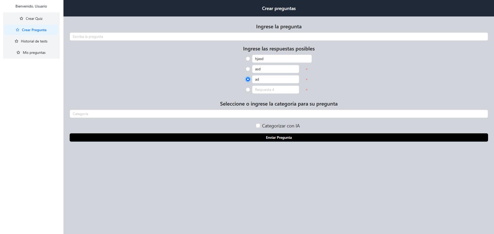

# Caso de Uso: Crear Preguntas

## Descripción
Este caso de uso describe el proceso mediante el cual un colaborador autenticado en la plataforma puede crear y publicar una nueva pregunta de tipo selección múltiple. La funcionalidad incluye la definición del texto de la pregunta, la configuración de opciones de respuesta, la selección de la respuesta correcta, la asignación de categorías y la posibilidad de adjuntar material complementario, como imágenes.

## Actores
- **Primarios**: Colaborador Autenticado
- **Secundarios**: Sistema de la Plataforma

## Precondiciones
1. El colaborador debe estar autenticado en la plataforma.

## Postcondiciones
1. La pregunta ha sido guardada en la base de datos de la plataforma.
2. La pregunta está disponible para ser vista por otros usuarios.

## Flujo Principal
1. El colaborador accede a la sección de "Crear Pregunta".
2. El Sistema muestra un formulario para la creación de preguntas.
3. El colaborador ingresa el texto de la pregunta, las opciones de respuesta, selecciona la respuesta correcta y asigna una o varias categorías.
4. El colaborador puede adjuntar material complementario opcional (ej: imágenes).
5. El colaborador hace clic en el botón "Guardar Pregunta".
6. El Sistema valida la información ingresada (texto de la pregunta, opciones, respuesta correcta, categorías).
7. El Sistema guarda la pregunta en la base de datos y registra al autor.
8. El Sistema muestra un mensaje de confirmación al colaborador indicando que la pregunta ha sido registrada exitosamente.

## Flujos Alternativos
### FA-01: Datos incompletos o inválidos
1. En el paso 6 del flujo principal, el Sistema detecta que la información ingresada no es válida (ej: falta el texto de la pregunta, opciones, respuesta correcta o categorías).
2. El Sistema muestra un mensaje de error al colaborador indicando los campos que deben ser corregidos.
3. El colaborador corrige la información y vuelve al paso 5 del flujo principal.

### FA-02: Error al guardar la pregunta
1. En el paso 7 del flujo principal, si ocurre un error en el sistema al guardar la pregunta:
    1.1. El Sistema muestra un mensaje de error indicando que no se pudo guardar la pregunta.
    1.2. El colaborador puede intentar guardar nuevamente o cancelar el proceso.

## Prototipos

## Requerimientos Especiales
- La plataforma debe garantizar la seguridad y privacidad de las preguntas registradas.
- El sistema debe validar que el texto de la pregunta no exceda los 200 caracteres.
- El sistema debe validar que el texto de la pregunta contenga al menos 50 caracteres.
- Cada pregunta debe tener al menos dos opciones de respuesta y una respuesta correcta seleccionada.

## Escenarios de Prueba
| Entrada | Salida Esperada |
|---------|-----------------|
| Colaborador autenticado accede a "Crear Pregunta", ingresa texto válido, opciones, selecciona una respuesta correcta y asigna categorías, luego hace clic en "Guardar". | La pregunta se guarda exitosamente y se muestra un mensaje de confirmación. |
| Colaborador autenticado accede a "Crear Pregunta" e intenta guardar una pregunta sin ingresar texto. | El sistema muestra un mensaje de error indicando que el texto de la pregunta es obligatorio. |
| Colaborador autenticado accede a "Crear Pregunta" e intenta guardar una pregunta con menos de dos opciones de respuesta. | El sistema muestra un mensaje de error indicando que debe haber al menos dos opciones de respuesta. |
| Colaborador autenticado accede a "Crear Pregunta" e intenta crear una pregunta con más de 200 caracteres. | El sistema muestra un mensaje de error indicando que excedió la cantidad de caracteres permitidos. |
| Colaborador autenticado accede a "Crear Pregunta" e intenta crear una pregunta con menos de 50 caracteres. | El sistema muestra un mensaje de error indicando que la cantidad de caracteres ingresados es insuficiente. |
---

**Documento Preparado Por:** [Luis Diego Irola C23941]  
**Fecha:** [11-04-2025]
