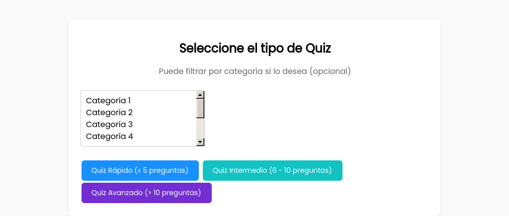

## Caso de uso: **Generar Quiz**

## Descripción
Este caso de uso describe el proceso mediante el cual un colaborador autenticado accede a la sección de "Crear Quiz" y genera una prueba estructurada desde el banco de preguntas disponible en la plataforma. El colaborador podrá elegir entre diferentes tipos de quiz según la cantidad de preguntas, y se generará una estructura adecuada sin incluir aún su resolución.

## Actores
- **Primarios**: Colaborador
- **Secundarios**: Sistema de la Plataforma 

## Precondiciones
1. El colaborador debe estar autenticado en el sistema.
2. El sistema debe contar con preguntas disponibles en el banco.

## Postcondiciones
1. Se genera una prueba estructurada según el tipo seleccionado.  
2. La estructura del quiz queda registrada como “en progreso” hasta que el usuario la resuelva.

# Flujo Principal
1. El colaborador accede a la sección de **Crear Quiz**.  
2. El sistema muestra las opciones para seleccionar el tipo de quiz:  
   - **Quiz Rápido** (5 preguntas o menos)  
   - **Quiz Intermedio** (más de 5 pero no más de 10 preguntas)  
   - **Quiz Avanzado** (más de 10 preguntas)  
3. El colaborador selecciona el tipo de quiz deseado.  
4. El sistema verifica la cantidad de preguntas disponibles en el banco:  
   - Si hay suficientes preguntas, continúa con la generación normal.  
   - Si hay menos preguntas que las requeridas por el tipo seleccionado, el sistema genera el quiz con la **cantidad máxima posible** y **notifica al colaborador**.  
5. El colaborador hace clic en **"Generar Quiz"**.  
6. El sistema selecciona aleatoriamente las preguntas necesarias desde el banco, asegurando variedad.  
7. El sistema estructura el quiz con las preguntas seleccionadas.  
8. El sistema guarda el estado del quiz como “en progreso”.

## Flujos Alternativos  

### FA-01: No hay suficientes preguntas disponibles  
1. En el paso 4, si el sistema detecta que no hay suficientes preguntas en el banco para el tipo de quiz seleccionado:  
   - El sistema genera automáticamente el quiz con la cantidad **máxima disponible** de preguntas.  
   - El sistema muestra un mensaje informativo al colaborador indicando que se generó un quiz con menos preguntas debido a la disponibilidad limitada.  
   - El colaborador continúa con el quiz generado o puede decidir regresar y seleccionar un tipo diferente.
### FA-02: Fallo al acceder al banco de preguntas  
1. Si en cualquier paso ocurre un error de conexión con el banco de preguntas:  
   - El sistema muestra un mensaje de error indicando un problema de acceso o disponibilidad.

## Prototipos

## Requerimientos Especiales  
- El sistema debe validar dinámicamente la cantidad de preguntas disponibles por tipo de quiz.  
- El sistema debe mostrar mensajes claros en caso de errores técnicos o de disponibilidad.  
- Se deben asegurar la variedad temática y de dificultad al seleccionar preguntas aleatorias.

## Escenarios de Prueba: Generación de Quizzes

| Escenario | Salida Esperada |
|:----------|:----------------|
| El colaborador autenticado selecciona “Quiz Intermedio” y presiona “Generar Quiz”, existiendo suficientes preguntas en el banco. | El sistema genera un quiz de entre 6 y 10 preguntas y muestra la estructura al usuario. |
| El colaborador solicita un “Quiz Avanzado” con más de 10 preguntas, pero solo hay 7 en el banco. | El sistema muestra un mensaje indicando que no hay suficientes preguntas disponibles para generar ese tipo de quiz. |
| El sistema presenta un error al intentar acceder al banco de preguntas. | Se muestra un mensaje de error indicando un problema con la conexión o la base de datos. |

**Documento Preparado Por:** Kendall Sánchez & Jaziel Rojas  
**Fecha:** 2025-06-06
