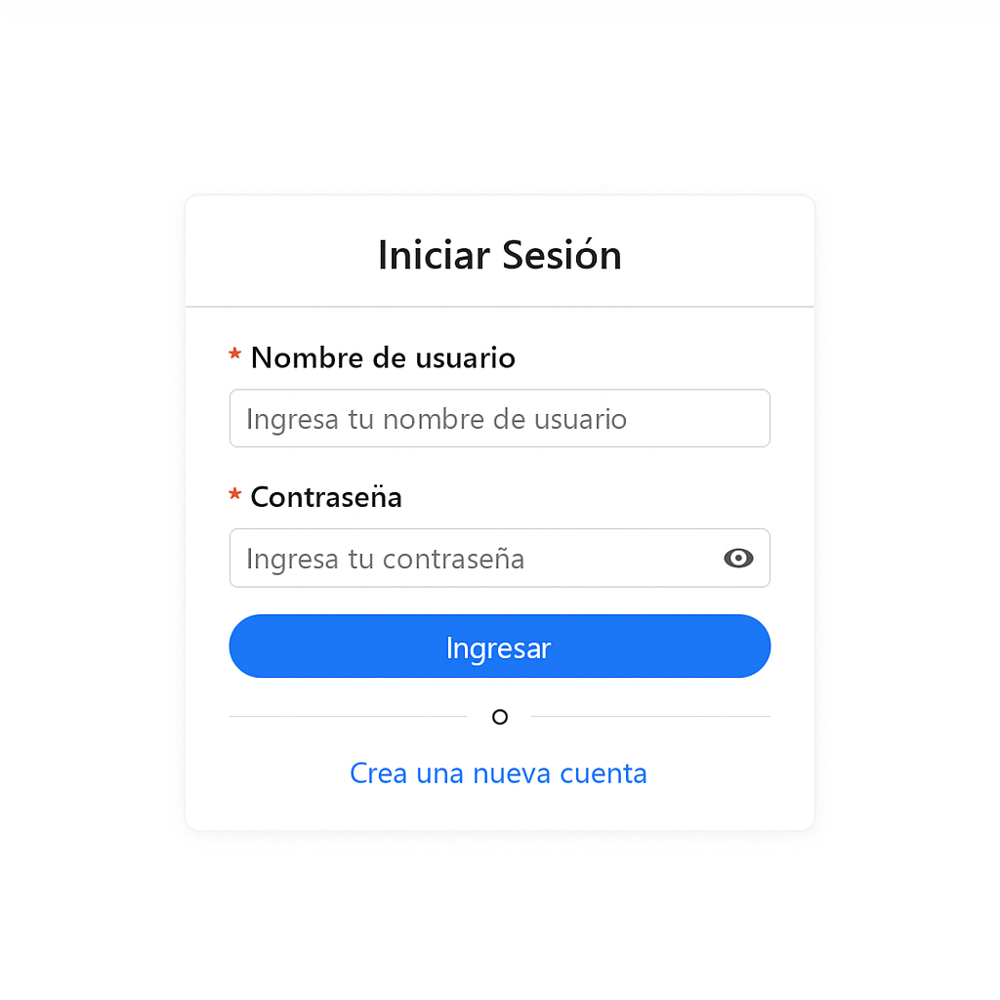

# Caso de Uso: Iniciar Sesión

## Descripción
Este caso de uso describe el proceso mediante el cual un usuario registrado de la plataforma social de aprendizaje puede iniciar sesión utilizando su nombre de usuario único y su contraseña. El propósito de esta funcionalidad es permitir a los usuarios acceder a sus cuentas de manera segura, garantizando que solo los usuarios autenticados puedan acceder a su información personal y participar activamente en la plataforma.

## Actores
- **Primarios**: Usuario (Colaborador y Administrador)
- **Secundarios**: Sistema

## Precondiciones
- El usuario debe estar registrado y verificado en la plataforma.
- El usuario debe conocer su nombre de usuario y contraseña.
- El sistema debe contar con una base de datos con los usuarios registrados y sus credenciales almacenadas de manera segura.

## Postcondiciones
- El usuario ha iniciado sesión correctamente y tiene acceso a su cuenta.
- Si las credenciales son incorrectas, se muestra un mensaje de error al usuario.
- El usuario puede acceder a todas las funcionalidades habilitadas según su rol.

## Flujo Principal
1. El Usuario accede a la página de inicio de sesión.
2. El Sistema muestra un formulario de inicio de sesión con campos para el nombre de usuario y la contraseña.
3. El Usuario ingresa su nombre de usuario y contraseña.
4. El Usuario hace clic en el botón "Ingresar".
5. El Sistema valida las credenciales ingresadas:
    - Si las credenciales son correctas, el sistema autentica al usuario. **[FA-01]**
    - El sistema determina el rol del usuario (colaborador o administrador) y redirige a la página principal correspondiente.
    - El sistema muestra las opciones correspondientes a su rol.

## Flujos Alternativos

### FA-01: Las credenciales no son válidas
- El Sistema muestra un mensaje de error indicando que el nombre de usuario o la contraseña son incorrectos.
- El Usuario puede intentar iniciar sesión nuevamente.

## Prototipos

## Requerimientos Especiales
- El sistema debe garantizar la seguridad de las contraseñas utilizando técnicas de almacenamiento seguro (como el hashing).
- La plataforma debe ser accesible de manera rápida y eficiente en dispositivos móviles y de escritorio.

## Escenarios de Prueba
| Entrada                                                                                     | Salida Esperada                                                                                   |
|---------------------------------------------------------------------------------------------|---------------------------------------------------------------------------------------------------|
| Usuario ingresa un nombre de usuario y contraseña correctos y hace clic en "Ingresar".  | El usuario es redirigido a su página principal o dashboard con acceso completo a sus funcionalidades. |
| Usuario ingresa un nombre de usuario o una contraseña incorrecta y hace clic en "Ingresar". | El sistema muestra un mensaje de error indicando que el nombre de usuario o la contraseña son incorrectos. |
| Usuario ingresa el nombre de usuario pero deja el campo de contraseña vacío y hace clic en "Ingresar". | El sistema muestra un mensaje de error indicando que el campo de contraseña es obligatorio. |
| Usuario ingresa la contraseña pero deja el campo de nombre de usuario vacío y hace clic en "Ingresar". | El sistema muestra un mensaje de error indicando que el campo de nombre de usuario es obligatorio. |

---

Documento Preparado Por: [Minor Hernández Navarro]  
Fecha: [12-04-2025]
