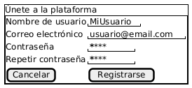

# Caso de Uso: Registro de Colaborador en la plataforma. [RF-06]**

## Descripción
El presente caso de uso describe el proceso mediante el cual un nuevo colaborador puede crear una cuenta personal en la plataforma social de aprendizaje colaborativo, proporcionando datos básicos como nombre de usuario, correo electrónico y contraseña. Incluye validaciones de formato y seguridad, así como el envío opcional de un correo de confirmación.

## Actores
- **Primarios:** Colaborador (nuevo usuario)  
- **Secundarios:** Sistema

## Precondiciones
- El colaborador no debe tener una cuenta registrada previamente con el mismo correo o nombre de usuario.

## Postcondiciones
- La cuenta del colaborador queda registrada en el sistema.
- El colaborador puede iniciar sesión en la plataforma una vez registrado, y opcionalmente el colaborador recibe un correo de confirmación.

## Flujo Principal
1. El Colaborador accede a la sección de "Registrarse".
2. El Sistema muestra un formulario de registro con campos para nombre de usuario, correo electrónico, contraseña y confirmación de contraseña.
3. El Colaborador completa el formulario con los datos requeridos y selecciona la opción “registrarse”.
4. El Sistema valida que el correo electrónico tenga un formato válido [FA-01].
5. El Sistema valida que la contraseña cumpla con los criterios de seguridad [FA-01].
6. El Sistema valida que los campos de contraseña coincidan [FA-02].
7. El Sistema guarda la información del Colaborador y muestra un mensaje de éxito.
8. El Sistema envía un correo de confirmación al correo ingresado.
9. El Sistema muestra un mensaje de éxito indicando que el registro fue completado.

## Flujos Alternativos

### FA-01: Validación de correo y contraseña fallida
En el paso 4 o 5 del flujo principal, el Sistema detecta que el correo o la contraseña no cumplen con los requisitos.
- El Sistema muestra un mensaje de error indicando el problema.
- El Colaborador corrige la información y regresa al paso 3.

### FA-02: Contraseñas no coinciden
- El Sistema detecta que los campos de contraseña no coinciden y muestra un mensaje de error indicando el problema.
- El Colaborador corrige la información y regresa al paso 3.

## Prototipos

 

## Requerimientos Especiales
- Las contraseñas deben almacenarse utilizando un algoritmo de cifrado seguro (hash).
- El formato de correo debe considerarse correcto si contiene un “@” y “.com”.
- El formato de contraseña debe considerarse correcto si contiene mínimo 8 caracteres, mayúsculas, minúsculas y un número.
- Se debe prevenir el registro de cuentas duplicadas con el mismo correo electrónico.

## Casos de Entrada y Salida Esperada

| Entrada                                                                 | Salida Esperada                                |
|------------------------------------------------------------------------|------------------------------------------------|
| Colaborador ingresa correo válido, contraseña segura y nombre de usuario | Registro exitoso, mensaje de confirmación      |
| Colaborador intenta registrarse con correo sin “@” o sin “.com”       | Error: formato de correo no válido             |
| Colaborador ingresa una contraseña débil (ej. “abc123”)               | Error: contraseña no cumple con los requisitos |
| Colaborador ingresa contraseñas que no coinciden                      | Error: las contraseñas no coinciden            |
| Colaborador hace clic en “Cancelar” durante el registro              | Formulario cerrado sin guardar datos           |