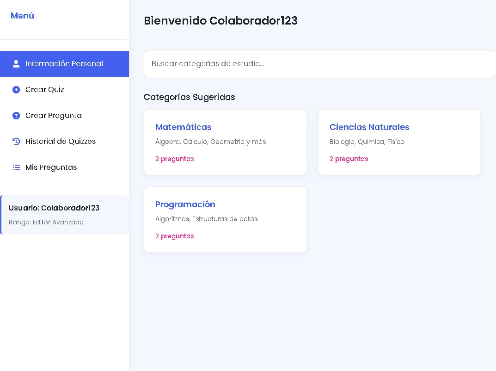

# Caso de Uso: Visualizar Interfaz de Inicio para Colaboradores

## Descripción
El presente caso de uso describe la interacción de un colaborador autenticado con la página de inicio de la plataforma de aprendizaje colaborativo. Al acceder, el colaborador visualizará un menú lateral con opciones clave para su rol y una sección principal para explorar categorías de estudio, además de una visualización básica de su información personal dentro del menú lateral.

## Actores
- **Primarios:** Colaborador (usuario autenticado)
- **Secundarios:** Sistema

## Precondiciones
- El Colaborador debe haber iniciado sesión exitosamente en la plataforma.

## Postcondiciones
- El Colaborador visualiza el menú lateral con las opciones mencionadas.
- El Colaborador visualiza la sección principal con sugerencias de categorías y un campo de búsqueda.
- El Colaborador puede ver su nombre de usuario y rango al interactuar con la opción "Información Personal" del menú lateral.

## Flujo Principal
1. El Colaborador accede a la página principal de la plataforma después de iniciar sesión.
2. El Sistema muestra la página principal con un menú lateral en la izquierda y una sección principal a la derecha.
3. El Sistema muestra en el menú lateral las siguientes opciones:
    * Información Personal (elemento interactivo)
    * Crear Quiz
    * Crear Pregunta
    * Historial de Quizzes
    * Mis Preguntas
4. El Sistema muestra en la parte superior del menú lateral el texto "Usuario".
5. El Colaborador visualiza en la sección principal una lista de unas pocas categorías de estudio aleatorias.
6. El Colaborador visualiza en la sección principal un campo de entrada de texto para buscar categorías.
7. El Colaborador hace clic en la opción "Información Personal" del menú lateral.
8. El Sistema muestra el nombre de usuario y el rango del colaborador en la sección de "Información Personal" del menú lateral (puede ser un despliegue o una actualización del texto).

## Flujos Alternativos

### FA-01: Menú Lateral no carga correctamente
En el paso 3, si el menú lateral no se carga o alguna de las opciones no es visible.
- El Sistema muestra un mensaje de error genérico o indica problemas de conexión.
- El Colaborador puede intentar recargar la página.

### FA-02: Sección de Categorías no carga
En el paso 5, si la lista de categorías aleatorias no se muestra.
- El Sistema muestra un mensaje indicando que no se pudieron cargar las categorías en este momento.
- El Colaborador aún puede utilizar el campo de búsqueda.

### FA-03: Información Personal no se muestra
En el paso 8, si al hacer clic en "Información Personal" no se muestra el nombre de usuario y el rango.
- El Sistema muestra un mensaje de error indicando que la información del perfil no está disponible en este momento.

## Prototipos

 

## Requerimientos Especiales
- El listado de categorías aleatorias debe ser dinámico y variar en cada carga o con cierta frecuencia.
- La información del nombre de usuario y rango debe obtenerse del contexto de la sesión del usuario autenticado.

## Casos de Entrada y Salida Esperada

| Entrada                                                                 | Salida Esperada                                                                                                                                                                                             |
|-------------------------------------------------------------------------|-------------------------------------------------------------------------------------------------------------------------------------------------------------------------------------------------------------|
| Colaborador autenticado accede a la página principal                     | Visualización del menú lateral con las opciones, la sección de categorías aleatorias y el campo de búsqueda.                                                                                              |
| Colaborador hace clic en "Información Personal" en el menú lateral       | Visualización del nombre de usuario y el rango del colaborador en la sección de "Información Personal" del menú lateral.                                                                                   |
| Colaborador visualiza la página principal                               | Visualización de unas pocas categorías de estudio aleatorias en la sección principal.                                                                                                                        |
| Colaborador ingresa texto en el campo de búsqueda de categorías          | (En este sprint) La interfaz registra el texto ingresado (la funcionalidad de búsqueda real se implementará en futuros sprints).                                                                           |
| Ocurre un error al cargar las categorías aleatorias                     | Visualización de la página principal con el menú lateral, pero con un mensaje indicando que las categorías no se pudieron cargar. El campo de búsqueda sigue disponible.                                     |
| Ocurre un error al obtener la información personal del usuario          | Visualización de la página principal con el menú lateral, pero al hacer clic en "Información Personal" se muestra un mensaje de error indicando que la información no está disponible temporalmente.       |