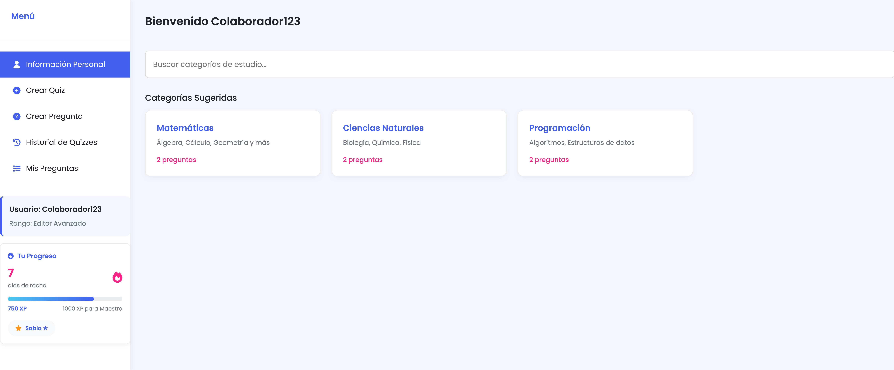

## Título del Caso de Uso: **Sistema de Racha Diaria, XP y Rangos**

## Descripción
Este caso de uso describe cómo un **colaborador** autenticado puede acumular experiencia (XP) y mantener una racha diaria al participar activamente en la plataforma (por ejemplo, resolviendo quizzes, comentando y creando preguntas), con el fin de fomentar el aprendizaje continuo y permitir la progresión a través de distintos rangos: **Aprendiz → Pensador → Sabio**.

## Actores
- **Primarios**: Colaborador 
- **Secundarios**: Sistema de la Plataforma

## Precondiciones
- El colaborador debe estar autenticado en la plataforma.  
- El sistema debe tener definidos los umbrales de XP para los rangos.  
- El sistema debe registrar las fechas de actividad del colaborador.

## Postcondiciones
- Se actualiza la racha diaria del colaborador, si aplica.  
- Se incrementa el XP del colaborador según la actividad realizada.  
- El sistema verifica si el colaborador ha alcanzado un nuevo rango y, de ser así, lo actualiza.

## Flujo Principal
1. El Colaborador realiza una acción en la plataforma que otorga XP:
   - Publicar una pregunta (**10 XP**)
   - Comentar un quiz con al menos 5 preguntas (**20 XP**)
   - Comentar un quiz con más de 5 preguntas (**50 XP**)
   - Resolver un quiz (**XP configurable** por número de preguntas/respuestas correctas)
2. El Sistema registra la actividad con sello de tiempo.
3. El Sistema verifica si hubo actividad el día anterior:
   - Si **sí**, incrementa la racha diaria.
   - Si **no**, reinicia la racha a 1.
4. El Sistema incrementa el XP acumulado del colaborador.
5. El Sistema verifica si el nuevo XP supera el umbral para un nuevo rango:
   - Si **sí**, actualiza el rango del colaborador y muestra notificación.
6. El Sistema actualiza la visualización del perfil del colaborador mostrando:
   - Racha diaria actual  
   - XP acumulado  
   - Rango actual

## Flujos Alternativos

### FA-01: El Colaborador no realiza actividad durante el día
- El Sistema detecta que el colaborador no tuvo actividad el día anterior.  
- Al siguiente inicio de sesión o actividad, la racha diaria se reinicia a 1.

### FA-02: Error en el registro de actividad
- Si ocurre un error al registrar la actividad (por ejemplo, falla de conexión o error de base de datos), el Sistema muestra un mensaje de error.  
- El Colaborador puede intentar nuevamente la acción.

### FA-03: Acción no válida para XP
- El Colaborador realiza una acción que no otorga XP.  
- El Sistema no modifica XP ni racha.

## Prototipos

## Requerimientos Especiales
- El sistema debe ser capaz de verificar la continuidad de días mediante el uso de fechas calendario (sin depender de la hora exacta).
- La visualización de XP, racha y rango debe ser clara y estar disponible desde el perfil del colaborador.
- Las actualizaciones de XP y racha deben ocurrir en tiempo real o al menos reflejarse inmediatamente tras realizar la acción.
- El sistema debe manejar adecuadamente zonas horarias para colaboradores internacionales.

## Tabla de Rangos

| Rango     | XP Requerido     |
|-----------|------------------|
| Aprendiz  | 0 - 199 XP       |
| Pensador  | 200 - 599 XP     |
| Sabio     | 600 XP en adelante |
