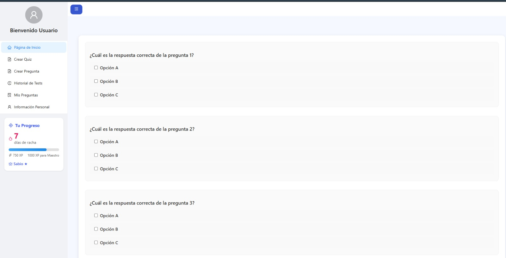

# Caso de uso: Resolver Quiz

## Descripción
Este caso de uso describe el proceso mediante el cual un colaborador puede responder una prueba generada previamente en la plataforma de aprendizaje colaborativo. Durante la resolución, el sistema permite responder preguntas en cualquier orden, guarda automáticamente las respuestas marcadas, y al finalizar, evalúa el desempeño y muestra la retroalimentación correspondiente.

## Actores
- Primario: Colaborador.
- Secundario: Sistema de la plataforma.

## Precondiciones

1. El colaborador debe estar autenticado en el sistema.
2. El colaborador debe haber generado el quiz previamente o tenerlo en curso.

## Postcondiciones
1. El sistema guarda el intento de resolución del quiz.
2. El sistema actualiza la experiencia (XP) del colaborador, evalúa el rango y la racha.
3. El sistema muestra el resultado con retroalimentación.

## Flujo Principal

1. El colaborador accede a la sección de “Historial Test” y selecciona un quiz pendiente para continuar o completar.
2. El sistema presenta todas las preguntas del quiz en una sola vista, permitiendo responderlas en cualquier orden.
3. El sistema guarda automáticamente las respuestas a medida que el colaborador las marca.
4. El colaborador puede abandonar y retomar el quiz más tarde sin perder el progreso.
5. Una vez respondidas todas las preguntas (o al decidir finalizar), el colaborador envía el quiz para su evaluación.
6. El sistema corrige automáticamente las respuestas.
7. El sistema calcula y muestra al colaborador:
    - Puntaje total obtenido.
    - Preguntas correctas e incorrectas.
    - Retroalimentación general.
8. El sistema actualiza la XP del colaborador según el puntaje.
9. El sistema evalúa si debe cambiar el rango del colaborador.
10. El sistema actualiza la racha si no había otro quiz completado ese día.

## Flujo Alternativo
### FA-01: El colaborador cierra sesión o se desconecta antes de terminar
- El sistema guarda automáticamente el estado del quiz y las respuestas marcadas hasta ese momento.
- Al volver a ingresar, el colaborador puede retomar el quiz desde donde lo dejó.

## Prototipos

## Escenarios de Prueba
| Escenario | Salida Esperada |
|:----------|:----------------|
|El colaborador responde todas las preguntas y presiona “Enviar”|El sistema evalúa y muestra resultados con XP, puntaje, racha, y guarda el historial. |
| El colaborador abandona el quiz sin finalizar | El sistema guarda las respuestas marcadas hasta ese punto.|
| El colaborador retoma un quiz previamente iniciado | El sistema presenta las preguntas con sus respuestas guardadas. |
El colaborador no responde ninguna pregunta y presiona "Enviar"| El sistema evalúa con puntaje 0 y guarda el intento. |