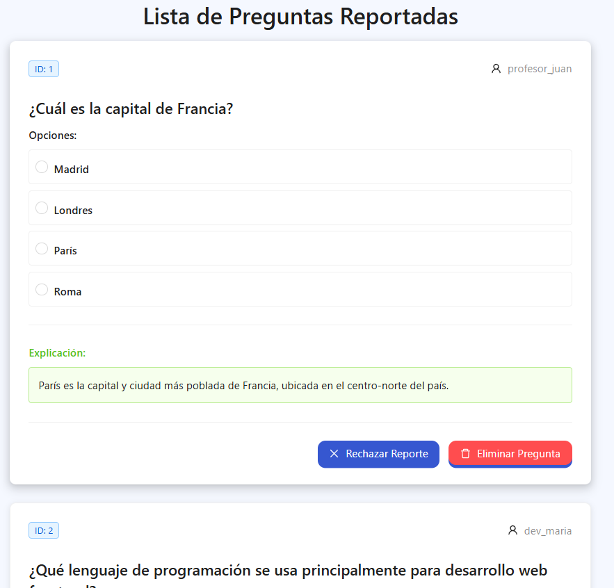

# Caso de Uso: Gestionar Preguntas Reportadas

## Descripción
Este caso de uso describe el proceso mediante el cual un administrador de la plataforma social de aprendizaje puede visualizar y gestionar las preguntas que han sido reportadas por los usuarios. El propósito de esta funcionalidad es permitir al administrador decidir si una pregunta debe ser eliminada del sistema o si el reporte debe ser rechazado, asegurando así la calidad del contenido publicado.

## Actores
- **Primarios**: Administrador
- **Secundarios**: Sistema

## Precondiciones
- El administrador debe haber iniciado sesión en la plataforma.
- Debe existir al menos una pregunta que haya sido reportada por los usuarios.
- El sistema debe contar con un módulo de gestión de reportes activo.

## Postcondiciones
- La pregunta puede ser eliminada de forma permanente si el administrador lo decide.
- El reporte puede ser descartado si el administrador considera válida la pregunta.
- El sistema actualiza el estado de la pregunta acorde a la acción tomada.

## Flujo Principal
1. El Administrador accede a la sección de "Panel de Moderación".
2. El Sistema muestra una lista con todas las preguntas reportadas.
3. El Administrador selecciona una pregunta para ver su detalle.
4. El Sistema muestra:
   - El enunciado de la pregunta.
   - Las opciones de respuesta.
   - La opción seleccionada por el usuario.
   - La explicación justificada.
   - El material de apoyo
5. El Administrador decide si:
   - Eliminar la pregunta. **[FA-01]**
   - Rechazar el reporte. **[FA-02]**

## Flujos Alternativos

### FA-01: El administrador decide eliminar la pregunta
- El Administrador hace clic en el botón **"Eliminar Pregunta"**.
- El Sistema muestra un componente `Popconfirm` con el mensaje:  
  *"¿Estás seguro de que quieres eliminar esta pregunta? Esta acción no se puede deshacer."*
- El Administrador puede:
  - Hacer clic en **"Sí, eliminar"**, tras lo cual:
    - El Sistema elimina la pregunta de forma permanente.
    - El Sistema actualiza la lista.
  - Hacer clic en **"Cancelar"**, tras lo cual:
    - El `Popconfirm` se cierra y no se realiza ninguna acción.

### FA-02: El administrador decide rechazar el reporte
- El Administrador hace clic en el botón **"Rechazar Reporte"**.
- El Sistema muestra un `Popconfirm` con el mensaje:  
  *"¿Estás seguro de que quieres rechazar este reporte?"*
- El Administrador puede:
  - Hacer clic en **"Sí, rechazar"**, tras lo cual:
    - El Sistema actualiza el estado del reporte como rechazado.
    - La pregunta se mantiene activa.
  - Hacer clic en **"Cancelar"**, tras lo cual:
    - El `Popconfirm` se cierra sin realizar cambios.

## Prototipos

## Requerimientos Especiales
- Ambos botones deben utilizar `Popconfirm` para evitar acciones accidentales.
- Las acciones deben ejecutarse únicamente tras la confirmación del administrador.
- El sistema debe reflejar los cambios inmediatamente en la interfaz.

## Escenarios de Prueba
| Entrada                                                                 | Salida Esperada                                                                                         |
|-------------------------------------------------------------------------|---------------------------------------------------------------------------------------------------------|
| El administrador accede a la lista de preguntas reportadas.            | El sistema muestra todas las preguntas con reporte activo.                                              |
| El administrador elimina una pregunta y confirma en el `Popconfirm`.   | El sistema elimina la pregunta y actualiza la vista.                                                    |
| El administrador rechaza un reporte y confirma en el `Popconfirm`.     | El sistema mantiene la pregunta activa y marca el reporte como rechazado.                              |
| El administrador cancela una acción en el `Popconfirm`.                | El sistema no realiza ningún cambio.                                                                    |

---

**Documento Preparado Por:** [Minor Hernández Navarro]  
**Fecha:** [07-06-2025]
