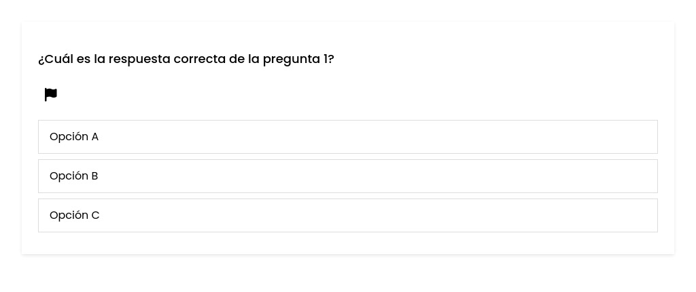

# Caso de uso: Reportar Pregunta

## Descripción
Este caso de uso describe cómo un colaborador puede reportar una pregunta mientras resuelve un quiz en la plataforma de aprendizaje colaborativo. Cada pregunta cuenta con un botón con ícono para reportar, permitiendo seleccionar una razón y enviar el reporte sin interrumpir el flujo del quiz. El sistema limita los reportes por día y muestra confirmaciones apropiadas.

## Actores
- Primario: Colaborador.
- Secundario: Sistema de la plataforma.

## Precondiciones

1. El colaborador debe estar autenticado en el sistema.
2. El colaborador debe estar resolviendo un quiz que contenga al menos una pregunta.
3. El colaborador no debe haber alcanzado el límite diario de reportes.

## Postcondiciones
1. El sistema registra el reporte de la pregunta con su razón.
2. El sistema muestra confirmación del envío y no interrumpe la resolución del quiz.
3. El sistema actualiza el conteo de reportes realizados por el colaborador ese día.

## Flujo Principal

1. El colaborador accede a un quiz en curso desde la sección “Historial de Tests” o al iniciar uno nuevo.
2. El sistema presenta las preguntas con sus opciones de respuesta y un botón con ícono para "Reportar"(Una banderita roja).
3. El colaborador identifica una pregunta que considera inapropiada y presiona el botón con ícono de "Reportar".
4. El sistema despliega un formulario emergente (modal) con una lista de razones de reporte.
5. El colaborador selecciona una razón (ej.: contenido inapropiado, confusa, mal redactada, otra).
    - En caso de seleccionar otra opción se le abre un espacio para especificar cual.
    - Este apartado tiene una extensión máxima de 20 caracteres.
    - En la sección de comentarios adicionales, la cual es opcional la extensión máxima es de 400 caracteres. 
6. El colaborador envía el reporte.
7. El sistema valida que el límite diario no se haya alcanzado.
    - El límite diario por colaborador es de 10 reportes.
    - El colaborador puede hacer un solo reporte por cada pregunta. 
    - Una vez que haga el reporte esa pregunta deja de contar en el quiz, no se le suma o resta puntos. 
8. El sistema registra el reporte asociado a la pregunta y muestra una notificación confirmando el envío.
9. El colaborador puede continuar resolviendo el quiz normalmente.

## Flujo Alternativo
### FA-01: El colaborador intenta enviar un reporte sin razón seleccionada
- El sistema bloquea el envío y solicita seleccionar una razón para continuar.

### FA-02: Límite diario alcanzado
- El sistema impide el reporte y muestra el mensaje:
    “Has alcanzado el número máximo de reportes permitidos por hoy.”
### FA-03: Fallo técnico al guardar el reporte
- El sistema muestra un mensaje de error y recomienda intentar más tarde.

## Prototipos

## Escenarios de Prueba
| Escenario | Salida Esperada |
|:----------|:----------------|
|El colaborador reporta una pregunta correctamente desde un quiz en curso |  El sistema guarda el reporte y muestra confirmación sin interrumpir el quiz.
|El colaborador intenta reportar sin seleccionar razón | El sistema bloquea el envío y muestra advertencia. 
| El colaborador alcanza el límite diario de reportes | El sistema bloquea nuevos reportes y muestra advertencia.
| El colaborador reporta varias preguntas del mismo quiz | Cada reporte se guarda individualmente y el sistema lleva control del conteo.