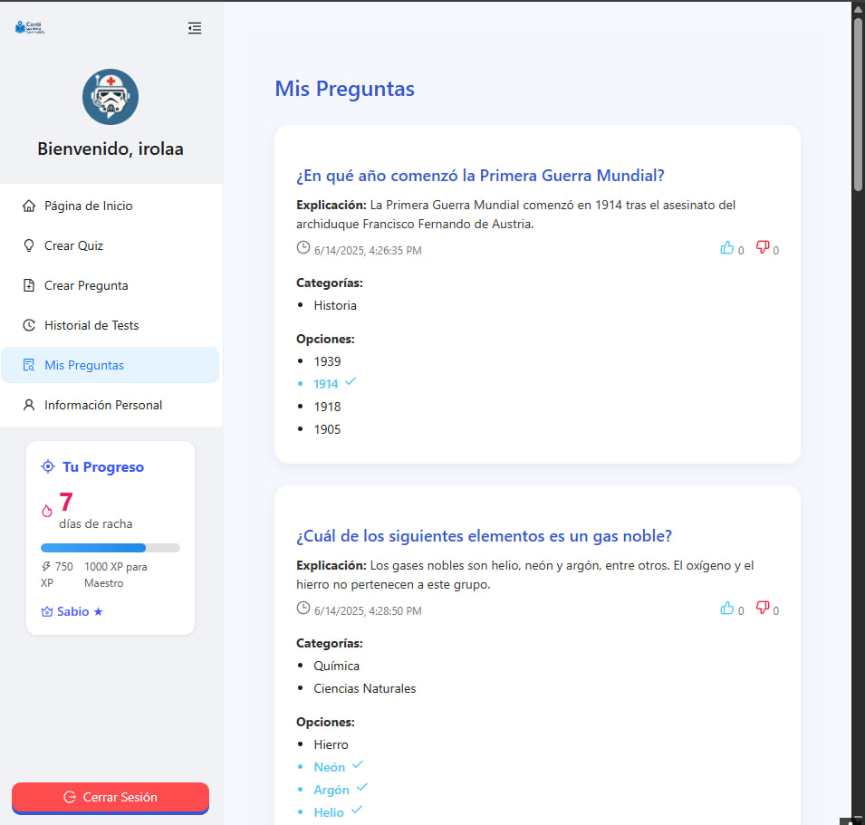

# Caso de Uso: Visualizar y Filtrar "Mis Preguntas"

## Descripción

Este caso de uso describe cómo un colaborador autenticado accede a la sección "Mis Preguntas" para consultar las preguntas que ha creado, con la posibilidad de filtrarlas según criterios relevantes como categoría, fecha, antigüedad y popularidad.

## Actores

- **Primarios**: Colaborador Autenticado  
- **Secundarios**: Sistema de la Plataforma

## Precondiciones

1. El colaborador debe estar autenticado en la plataforma.
2. El colaborador debe haber creado al menos una pregunta previamente.

## Postcondiciones

1. Las preguntas se muestran correctamente según los filtros aplicados.
2. El colaborador puede acceder al detalle de una pregunta específica desde el listado.

## Flujo Principal

1. El colaborador accede a la sección "Mis Preguntas".
2. El sistema muestra un listado con todas las preguntas creadas por ese usuario.
3. El colaborador selecciona uno o varios filtros:
   - Categoría
   - Fecha (con calendario)
   - Orden (más recientes, más antiguas, más likeadas)
4. El sistema actualiza el listado según los criterios seleccionados.
5. El colaborador puede hacer clic sobre una pregunta para ver más detalles o editarla si tiene permisos.

## Flujos Alternativos

### FA-01: No hay preguntas creadas
1. Si el colaborador no ha creado ninguna pregunta, el sistema muestra un mensaje informativo con un enlace para crear una nueva pregunta.

### FA-02: No hay coincidencias con los filtros
1. Si no se encuentran resultados con los filtros seleccionados, el sistema muestra un mensaje indicando que no hay coincidencias y permite restablecer los filtros.

## Prototipos

## Requerimientos Especiales

- Los filtros deben ser aplicables sin recargar la página.
- El selector de fecha debe ser tipo calendario.
- Las preguntas deben mostrarse en formato resumen con posibilidad de expandir o acceder a más detalle.

## Escenarios de Prueba

| Entrada | Salida Esperada |
|---------|-----------------|
| Colaborador con 5 preguntas accede a "Mis Preguntas". | Se listan las 5 preguntas en orden cronológico por defecto. |
| Usuario filtra por categoría "Macroeconomía". | Se muestran solo las preguntas de esa categoría. |
| Usuario selecciona una fecha específica. | Se muestran solo las preguntas creadas en esa fecha. |
| Usuario selecciona ordenar por "más likeadas". | Se ordena el listado en base a la cantidad de "me gusta". |
| Usuario filtra por criterios sin resultados. | Se muestra mensaje indicando "No se encontraron preguntas con esos filtros". |

---

**Documento Preparado Por:** [Luis Diego Irola Hernández]  
**Fecha:** [17-06-2025]
