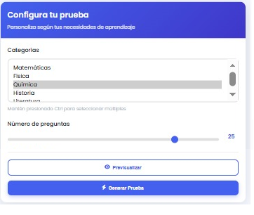

## Caso de uso: **Generar quizzes**

## Descripción
Este caso de uso describe el proceso mediante el cual un usuario puede generar una prueba estructurada a partir de un banco de preguntas registradas por un usuario o generadas por inteligencia artificial en la plataforma de aprendizaje colaborativo, realizar la autoevaluación y registrar el historial de resultados y calificaciones.

## Actores
- **Primarios**: Usuario (Colaborador y Administrador)
- **Secundarios**: Sistema 

## Precondiciones
1. El usuario debe estar autenticado en el sistema.

## Postcondiciones
1. Se genera una prueba estructurada a partir del banco de preguntas.
2. Se almacena el historial de la prueba realizada y su calificación.

# Flujo Principal
1.  El usuario accede a la sección de autoevaluaciones.
2.  El usuario selecciona la cantidad de preguntas para la evaluación.
3.  El usuario selecciona la opción **"Generar Prueba"**.
4.  El sistema genera automáticamente una prueba estructurada utilizando preguntas del banco.
5.  El sistema presenta la prueba al usuario.
6.  El usuario responde todas las preguntas de la prueba.
7.  El usuario envía la prueba para su evaluación.
8.  El sistema corrige automáticamente la prueba.
9.  El sistema muestra la calificación al usuario.
10. El sistema guarda el historial de la prueba realizada, incluyendo:
   - Preguntas presentadas
   - Respuestas seleccionadas
   - Calificación obtenida
   - Fecha y hora de la prueba

# Flujo Alternativo

### FA-01: Error en la generación de la prueba
- En el paso 3, si no hay suficientes preguntas en el banco, el sistema le notifica al usuario. 

## Prototipos

## Requerimientos especiales

- El sistema debe mostrar un mensaje detallado con la razón por la cual la prueba no se pudo realizar.
- Si el sistema falla al intentar acceder al banco de preguntas, debe mostrar un mensaje de error general indicando que hay un problema con la base de datos o la conexión.

## Escenarios de Prueba: Generación de Quizzes

| Escenario | Salida Esperada |
|:----------|:----------------|
| El usuario autenticado accede a la sección de autoevaluaciones, cuando selecciona 10 preguntas y presiona “Generar Prueba” | El sistema genera una prueba con 10 preguntas distintas del banco. |
| Cuando el usuario solicita una prueba de 15 preguntas y hay 10 preguntas disponibles en el banco | El sistema muestra un mensaje de notificación indicando que no hay suficientes preguntas disponibles para realizar la prueba. |

**Documento Preparado Por:** Kendall Sánchez & Jaziel Rojas  
**Fecha:** 2025-04-12
