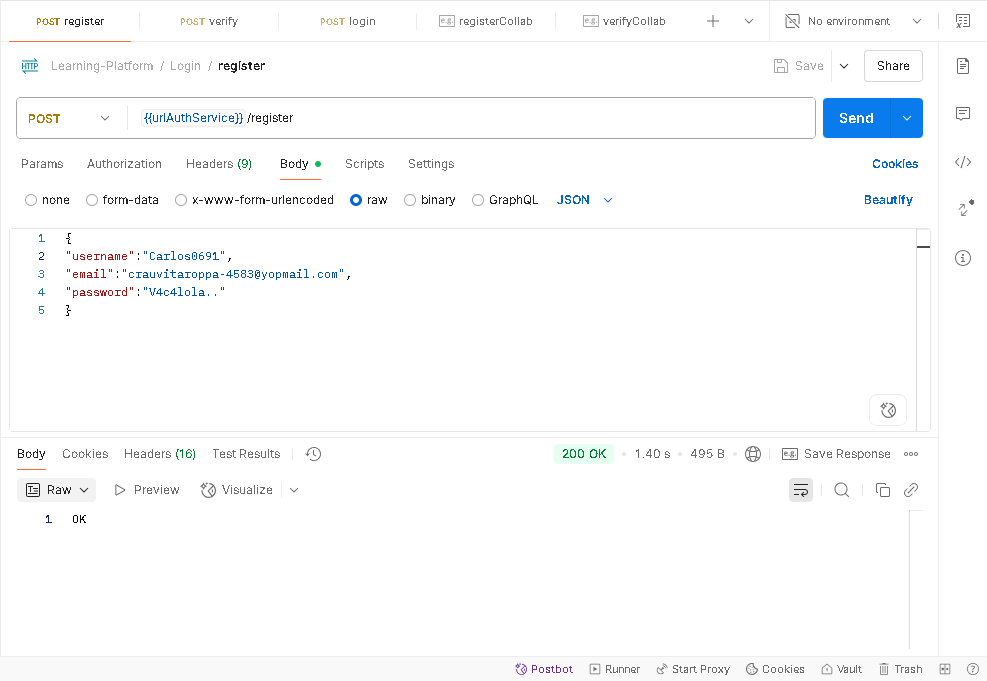
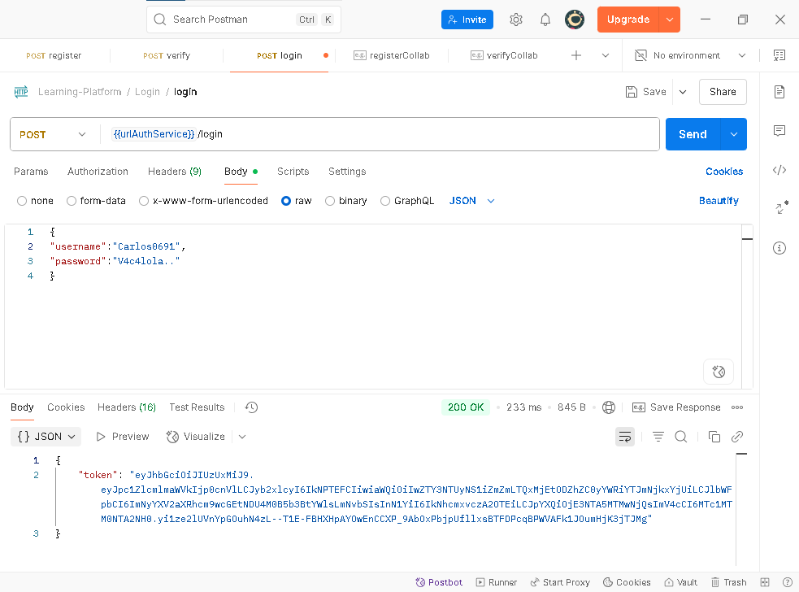
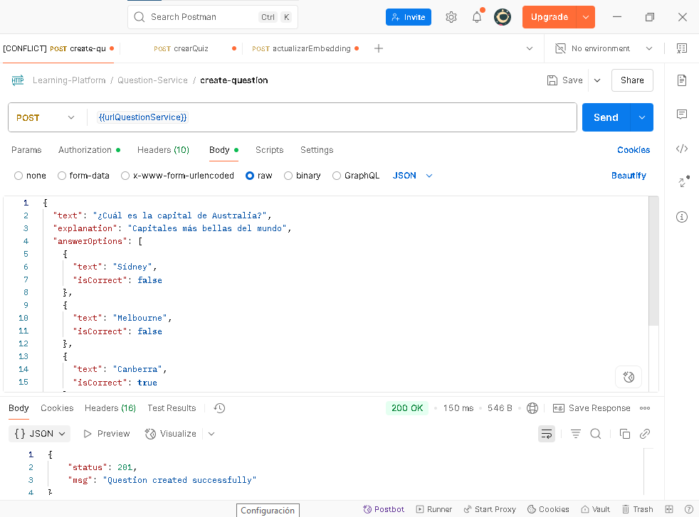
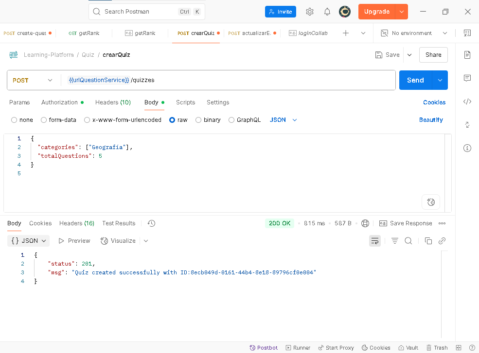
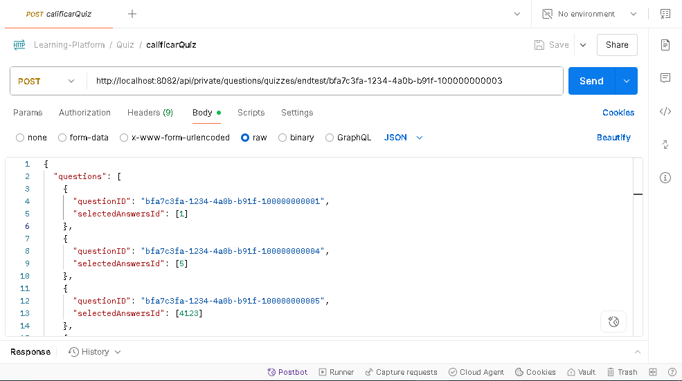

## Documentacion de pruebas Manuales

Este documento tiene como finalidad ejemplificar cómo se aplican las pruebas manuales para verificar que cada carta asociada cumpla sus criterios de aceptación de manera exitosa.

#### **Carta #16**
#### **Registrarse en la Plataforma** 
Como usuario de la plataforma de aprendizaje colaborativo, quiero poder crear una cuenta proporcionando mis datos básicos, para poder acceder a todas las funcionalidades de la plataforma y participar en la comunidad de aprendizaje.

**Criterios de Aceptación:**
Los usuarios deberán registrarse proporcionando una dirección de correo electrónico y una contraseña.
Se validará que el correo electrónico tenga un formato correcto (si se utiliza).
Se validará que la contraseña cumpla con ciertos criterios de seguridad (por ejemplo, longitud mínima).
Los usuarios recibirán una confirmación de registro.

#### **Carta #20** 
#### **Iniciar Sesión en la Plataforma**
Como usuario de la plataforma de aprendizaje colaborativo, quiero poder iniciar sesión en mi cuenta, para acceder a todas las funcionalidades de la plataforma.

**Criterios de Aceptación:**
Los usuarios podrán iniciar sesión utilizando su nombre de usuario o correo electrónico y la contraseña que registraron. Se validará la combinación del nombre de usuario o correo electrónico y la contraseña ingresada con la información almacenada en el sistema. En caso de que las credenciales sean incorrectas, se mostrará un mensaje de error que diga: "Credenciales incorrectas". Una vez que el usuario inicie sesión correctamente, será redirigido a la página principal de la plataforma.

#### **Carta #1**
#### **Crear preguntas**
Como usuario de la plataforma de aprendizaje colaborativo, quiero publicar preguntas sobre temas específicos, para que otros usuarios puedan responderlas y así fomentar el aprendizaje entre pares.

**Criterios de Aceptación:**
Los usuarios podrán publicar preguntas sobre temas específicos.
Las preguntas serán de selección múltiple.
Se debe registrar la persona que realizó la pregunta.
La pregunta debe ser categorizada.
Se debe indicar las respuestas correctas.
Se podrá adjuntar material adicional a la pregunta.

#### **Carta #2**
#### **Crear pruebas**
Como usuario de la plataforma de aprendizaje colaborativo, 
quiero que la plataforma genere pruebas a partir de las preguntas registradas, 
para que pueda evaluar mis conocimientos de manera estructurada.

**Criterios de Aceptación:**
La plataforma podrá generar pruebas a partir de las preguntas registradas.
Se debe guardar un historial de las pruebas realizadas por cada persona.
La calificación de las pruebas se realizará de manera automática.

#### **Carta #3**
#### **Resolver quizzes**
Como colaborador, quiero poder resolver quizzes y obtener retroalimentación inmediata,
para practicar y mejorar mi aprendizaje.

**Criterios de Aceptación:**
El usuario podrá responder preguntas dentro de un quiz.
Al terminar el quiz, se mostrará el puntaje y respuestas correctas/incorrectas.
El sistema contabilizará esta acción para la racha y el XP del usuario.

